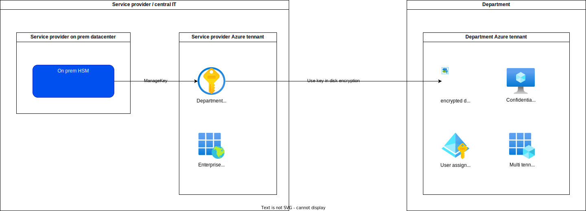

# Goal
To create a setup that uses disk encryption keys stored in a keyvault that sits in another tennant.

See also:
https://learn.microsoft.com/en-us/azure/virtual-machines/disks-cross-tenant-customer-managed-keys?tabs=azure-portal

# Architecture

# Requirements
- In order to run this script you need to meet the following pre requisites
- Run Windows 11 (other might work, untested)
- Have the lateste VS code on your PC (optional, but easier to fine tune the script)
- Have powershell terminal installed in VS Code
- Have the latest AZCLI in your PC
- Have AZCOPY installed on your PC

